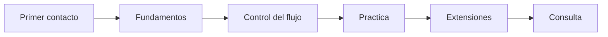

# Ruta de aprendizaje

Esta ruta propone un orden simple para aprender Thorio sin abrumarse.

## Etapa 1 - Primer contacto

- [Que es Thorio](../empezar/que-es-thorio.md)
- [Tu primer programa](../empezar/tu-primer-programa.md)

## Etapa 2 - Fundamentos

- [Inicio y fin](../fundamentos/inicio-y-fin.md)
- [Variables](../fundamentos/variables.md)
- [Mostrar y leer](../fundamentos/mostrar-y-leer.md)

## Etapa 3 - Control del flujo

- [Decisiones con si](../fundamentos/decisiones-si.md)
- [Ciclos mientras](../fundamentos/ciclos-mientras.md)

## Etapa 4 - Practica

- [Ejercicio 01 - Secuencia](../ejercicios/01-secuencia.md)

## Etapa 5 - Extensiones

- [Camile](../extensiones/camile.md)
- [Julie](../extensiones/julie.md)
- [Thorio + Camile + Julie](../extensiones/thorio-platform.md)
- [Como usar thorio-platform](../extensiones/usar-thorio-platform.md)

## Etapa 6 - Consulta

- [Sintaxis basica](../referencia/sintaxis-basica.md)

## Mapa

