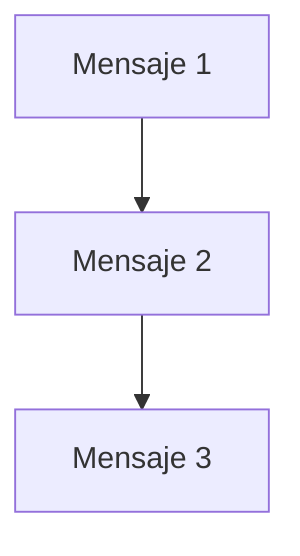

# Ejercicio 01 - Secuencia

## Objetivo

Practicar un programa que solo sigue pasos en orden.

## Problema

Escribe un programa que muestre tres mensajes:

- un saludo
- tu nombre
- una despedida

## Plantilla

```thorio
inicio
  mostrar "Hola"
  mostrar "Tu nombre aqui"
  mostrar "Hasta luego"
fin
```

## Que se practica

- estructura basica del programa
- uso de `mostrar`
- lectura del orden de ejecucion

## Pista visual



## Extiende el ejercicio

Cambia el segundo mensaje por una presentacion mas completa.
