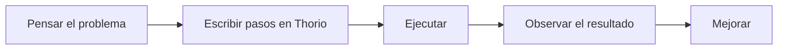

# Que es Thorio

Thorio es un lenguaje pensado para escribir programas con una sintaxis cercana al espanol.

Su objetivo no es solo ejecutar instrucciones, sino ayudar a aprender programacion de una forma mas clara y accesible.

## Que hace diferente a Thorio

- usa palabras en espanol como `inicio`, `fin`, `si` y `mientras`
- permite escribir programas dentro de bloques Markdown
- sirve para aprender logica antes de saltar a lenguajes mas complejos

## Como se ve un programa

```thorio
inicio
  mostrar "Hola mundo"
fin
```

## Que ideas aprenderas con Thorio

- secuencia
- variables
- decisiones
- repeticion
- funciones
- listas

## Flujo mental basico



## Siguiente paso

Continua con [Tu primer programa](./tu-primer-programa.md).
