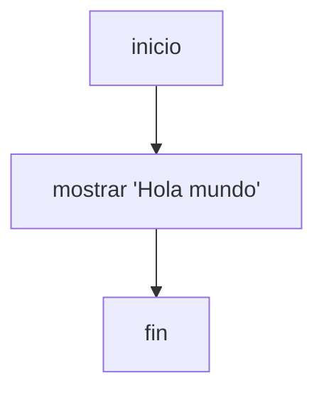

# Tu primer programa

El programa mas pequeno en Thorio tiene dos partes obligatorias:

- `inicio`
- `fin`

Entre esas dos palabras puedes poner instrucciones.

## Ejemplo

```thorio
inicio
  mostrar "Hola mundo"
fin
```

## Que ocurre aqui

- `inicio` marca el comienzo del programa
- `mostrar` escribe un valor en pantalla
- `fin` marca el cierre del programa

## Resultado esperado

```text
Hola mundo
```

## Diagrama de lectura



## Practica

Cambia el mensaje por tu nombre o por una frase propia.

## Siguiente paso

Continua con [Inicio y fin](../fundamentos/inicio-y-fin.md).
