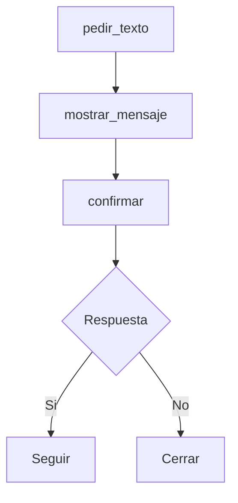

# Camile

`Camile` es la extension visual de Thorio.

Sirve para crear interacciones simples con ventanas, mensajes y preguntas al usuario.

## Que agrega Camile

- `mostrar_mensaje(...)`
- `pedir_texto(...)`
- `confirmar(...)`

## Cuando conviene usarla

Camile es util cuando quieres que el programa:

- pida datos con una ventana
- muestre mensajes mas visuales
- haga interacciones sencillas sin depender solo de consola

## Ejemplo

```thorio
inicio
  definir nombre como texto
  definir continuar como logico

  nombre = pedir_texto("¿Como te llamas?")
  mostrar_mensaje("Hola " + nombre)
  continuar = confirmar("¿Quieres continuar?")

  si continuar entonces
    mostrar_mensaje("Seguimos trabajando con Thorio y Camile")
  si_no
    mostrar_mensaje("Hasta luego " + nombre)
  fin_si
fin
```

## Flujo de una interaccion visual



## Idea pedagogica

Camile ayuda a que una persona principiante vea que un programa puede conversar con quien lo usa.

## Ejemplo relacionado

- [Hola Camile](../../examples/camile/hola-camile.md)

## Siguiente paso

Continua con [Julie](./julie.md).
