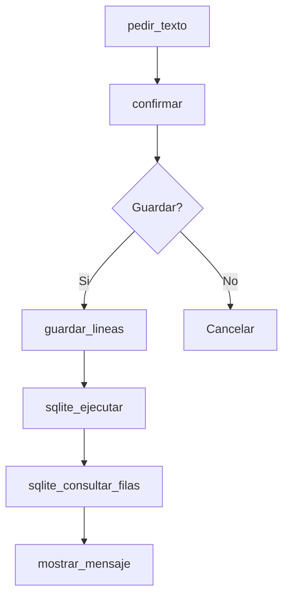

# Thorio + Camile + Julie

`thorio-platform` une el lenguaje base con las extensiones visuales y de almacenamiento.

Eso permite crear programas que:

- preguntan datos al usuario
- muestran mensajes en pantalla
- guardan archivos
- registran informacion en SQLite

## Por que importa

Esta combinacion muestra una idea clave de programacion aplicada:

- entrada
- proceso
- salida
- persistencia

## Ejemplo integrado

```thorio
funcion resumen(nombre: texto, tema: texto) retorna texto
  retornar nombre + " estudia " + tema
fin_funcion

inicio
  definir carpeta como texto
  definir ficha como texto
  definir base como texto
  definir nombre como texto
  definir tema como texto
  definir confirmarGuardado como logico
  definir lineas como lista_texto
  definir registros como lista_texto

  carpeta = crear_directorio("examples/platform/sandbox/registro")
  ficha = carpeta + "/ficha.md"
  base = carpeta + "/registro.sqlite"

  nombre = pedir_texto("Nombre del estudiante")
  tema = pedir_texto("Tema favorito")
  confirmarGuardado = confirmar("¿Guardar ficha y registro?")

  si confirmarGuardado entonces
    lineas = ["# Ficha", "Nombre: " + nombre, "Tema: " + tema, "Resumen: " + resumen(nombre, tema)]
    guardar_lineas(ficha, lineas)

    sqlite_ejecutar(base, "create table if not exists fichas(nombre text, tema text)")
    sqlite_ejecutar(base, "insert into fichas(nombre, tema) values ('" + nombre + "', '" + tema + "')")
    registros = sqlite_consultar_filas(base, "select nombre, tema from fichas order by nombre")

    mostrar_mensaje("Registro guardado: " + resumen(nombre, tema))
    mostrar_mensaje("Total fichas: " + longitud(registros))
  si_no
    mostrar_mensaje("Operacion cancelada")
  fin_si
fin
```

## Mapa del programa



## Ejemplo relacionado

- [Registro interactivo](../../examples/platform/registro-interactivo.md)

## Idea pedagogica

Esta pagina sirve para mostrar que Thorio puede ir mas alla de ejercicios pequenos y empezar a resolver flujos completos.
