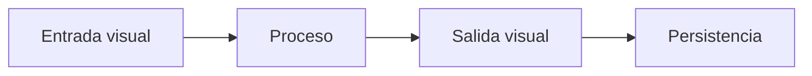
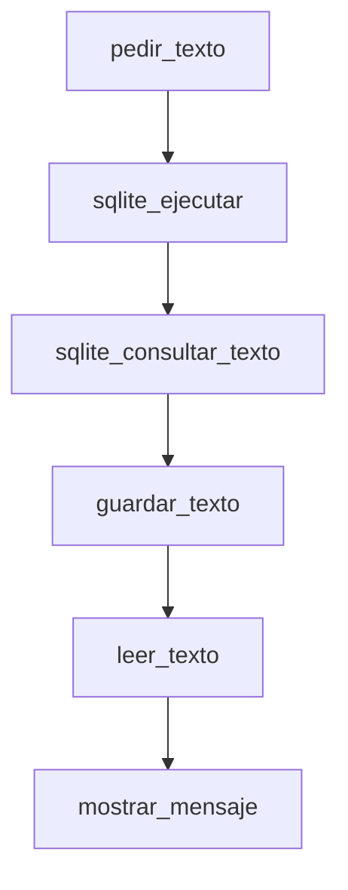
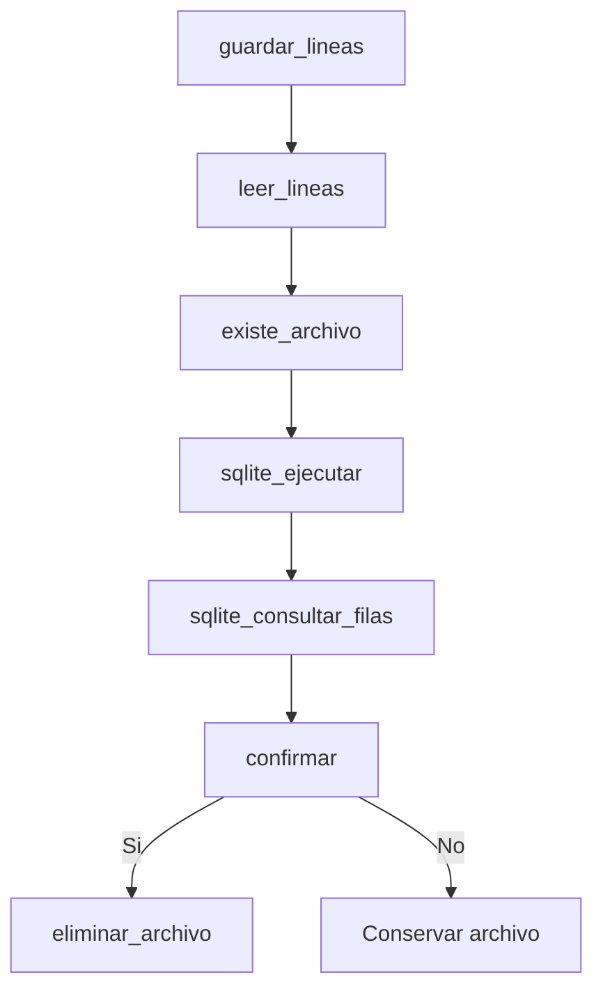

# Como usar thorio-platform

`thorio-platform` es la forma mas completa de usar Thorio cuando quieres combinar:

- logica del lenguaje base
- ventanas y dialogos de `Camile`
- archivos y SQLite de `Julie`

En la practica, esta distribucion sirve para construir programas que preguntan, procesan, muestran y guardan informacion.

## Cuando usarlo

Usa `thorio-platform` cuando tu programa necesite al mismo tiempo:

- interaccion visual
- persistencia en archivos
- persistencia en SQLite
- flujo completo de trabajo

## Caja de herramientas

### Interfaz visual

- `pedir_texto(...)`
- `mostrar_mensaje(...)`
- `confirmar(...)`

### Archivos

- `crear_directorio(...)`
- `guardar_texto(...)`
- `leer_texto(...)`
- `guardar_lineas(...)`
- `leer_lineas(...)`
- `existe_archivo(...)`
- `eliminar_archivo(...)`

### SQLite

- `sqlite_ejecutar(...)`
- `sqlite_consultar_texto(...)`
- `sqlite_consultar_filas(...)`

## Modelo mental

Piensa `thorio-platform` como un flujo de cuatro etapas:

1. pedir informacion
2. procesarla
3. mostrar resultados
4. guardar evidencia o historial



## Patron recomendado

La mayoria de programas completos siguen un esqueleto parecido a este:

```thorio
inicio
  definir dato como texto
  definir aprobado como logico
  definir carpeta como texto
  definir archivo como texto

  dato = pedir_texto("Ingresa un dato")
  aprobado = confirmar("¿Deseas guardarlo?")

  si aprobado entonces
    carpeta = crear_directorio("examples/platform/sandbox/demo")
    archivo = carpeta + "/salida.txt"
    guardar_texto(archivo, dato)
    mostrar_mensaje("Dato guardado")
  si_no
    mostrar_mensaje("Operacion cancelada")
  fin_si
fin
```

## Ejemplos para cubrir todas las funcionalidades

### 1. Registro interactivo

Este ejemplo muestra un flujo base de punta a punta:

- pide datos
- confirma si se guardan
- escribe una ficha en Markdown
- registra la informacion en SQLite
- muestra el resultado en pantalla

- [Guia integrada](./thorio-platform.md)
- [Ejemplo](../../examples/platform/registro-interactivo.md)

### 2. Agenda visual persistente

Este ejemplo suma una segunda capa:

- entrada visual con dos contactos
- persistencia en SQLite
- exportacion a un archivo de texto
- lectura del reporte guardado



- [Ejemplo](../../examples/platform/agenda-visual-persistente.md)

### 3. Panel de estudio

Este ejemplo recorre casi toda la superficie de `thorio-platform`:

- crea carpeta
- guarda lineas
- vuelve a leer lineas
- valida si el archivo existe
- crea y consulta una base SQLite
- confirma si desea eliminar el archivo
- elimina el archivo si la persona acepta



- [Ejemplo](../../examples/platform/panel-de-estudio.md)

## Como aprenderlo sin abrumarte

Este orden suele funcionar bien:

1. primero domina Thorio base
2. luego practica `Camile`
3. despues practica `Julie`
4. finalmente integra todo con `thorio-platform`

## Regla practica

Si tu programa ya necesita interfaz visual y guardar resultados, casi siempre conviene usar `thorio-platform` en lugar de trabajar cada extension por separado.
