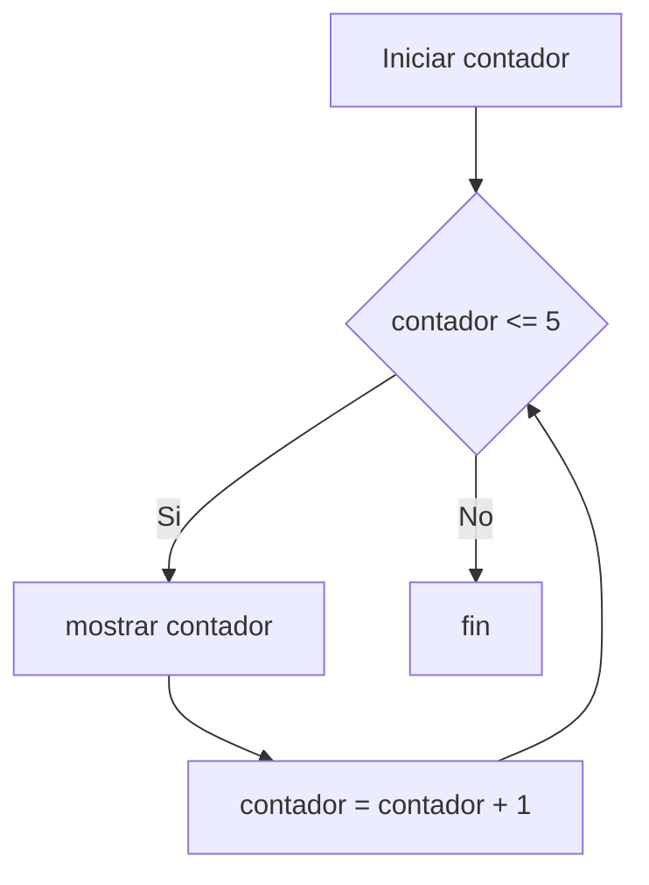

# Ciclos mientras

Un ciclo permite repetir instrucciones mientras una condicion siga siendo verdadera.

## Ejemplo

```thorio
inicio
  definir contador como entero

  contador = 1

  mientras contador <= 5 hacer
    mostrar contador
    contador = contador + 1
  fin_mientras
fin
```

## Que esta pasando

- `contador` comienza en `1`
- el programa entra al ciclo
- muestra el valor actual
- aumenta el contador
- vuelve a revisar la condicion

## Flujo del ciclo



## Practica

Haz un ciclo que muestre los numeros del 1 al 3.

## Siguiente paso

Continua con [Primer ejercicio](../ejercicios/01-secuencia.md).
