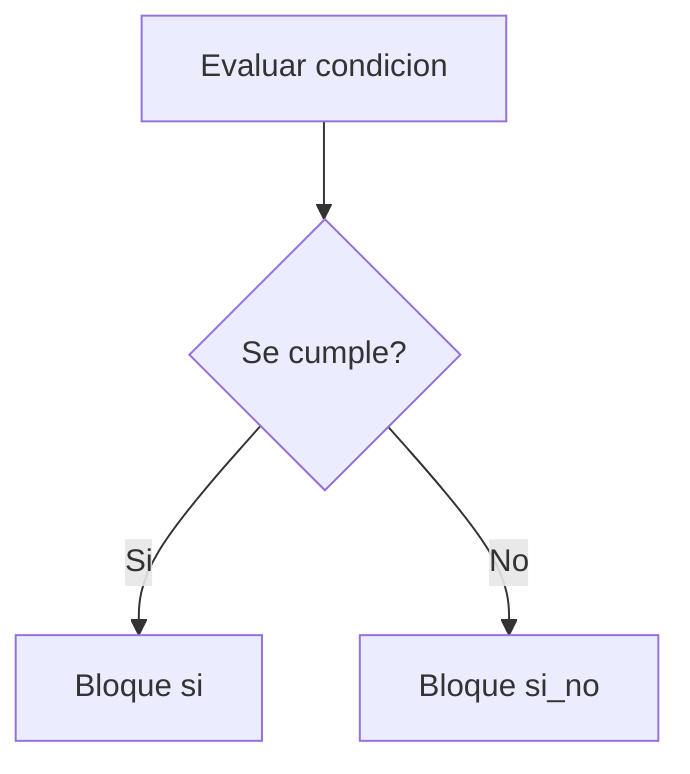

# Decisiones con si

Las decisiones permiten que un programa siga caminos distintos segun una condicion.

## Ejemplo

```thorio
inicio
  definir edad como entero

  edad = 20

  si edad >= 18 entonces
    mostrar "Puede votar"
  si_no
    mostrar "Aun no puede votar"
  fin_si
fin
```

## Como leerlo

- primero se evalua la condicion
- si la condicion es verdadera, se ejecuta el bloque `si`
- en caso contrario, se ejecuta `si_no`

## Flujo



## Practica

Escribe un programa que muestre si una persona puede entrar a una actividad cuando su edad es al menos 15.

## Siguiente paso

Continua con [Ciclos mientras](./ciclos-mientras.md).
