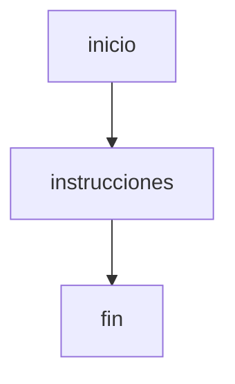

# Inicio y fin

Todo programa basico en Thorio comienza con `inicio` y termina con `fin`.

## Idea principal

Estas palabras delimitan el bloque principal del programa.

```thorio
inicio
  mostrar "Estoy dentro del programa"
fin
```

## Por que importa

Cuando aprendes programacion, es util identificar con claridad:

- donde empieza la ejecucion
- que instrucciones forman parte del programa
- donde termina el flujo principal

## Esquema



## Regla practica

Si un lector puede encontrar de inmediato el inicio y el cierre del programa, el codigo suele ser mas facil de seguir.

## Siguiente paso

Continua con [Variables](./variables.md).
