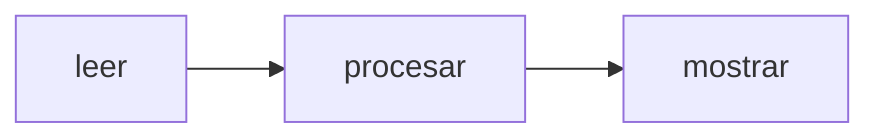

# Mostrar y leer

Programar no es solo calcular. Tambien es recibir datos y mostrar resultados.

## Salida con `mostrar`

```thorio
inicio
  mostrar "Bienvenido a Thorio"
fin
```

## Entrada con `leer`

```thorio
inicio
  definir nombre como texto

  leer nombre
  mostrar "Hola, " + nombre
fin
```

## Ciclo basico de un programa



## Idea clave

Muchos programas siguen esta secuencia:

1. leen informacion
2. la transforman
3. muestran el resultado

## Practica

Pide un nombre y muestra un saludo personalizado.

## Siguiente paso

Continua con [Decisiones con si](./decisiones-si.md).
