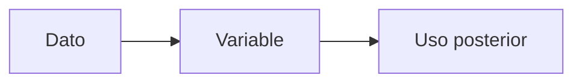

# Variables

Una variable es un nombre que usamos para guardar un valor y reutilizarlo despues.

## Ejemplo

```thorio
inicio
  definir nombre como texto
  definir edad como entero

  nombre = "Ana"
  edad = 12

  mostrar "Nombre: " + nombre
  mostrar "Edad: " + edad
fin
```

## Que aprender

- declarar variables
- asignar valores
- mostrar informacion guardada

## Como pensarlo



## Error comun

Declarar una variable y olvidar asignarle un valor antes de usarla.

## Practica

Crea variables para tu ciudad y tu comida favorita. Luego muestralas.

## Siguiente paso

Continua con [Mostrar y leer](./mostrar-y-leer.md).
