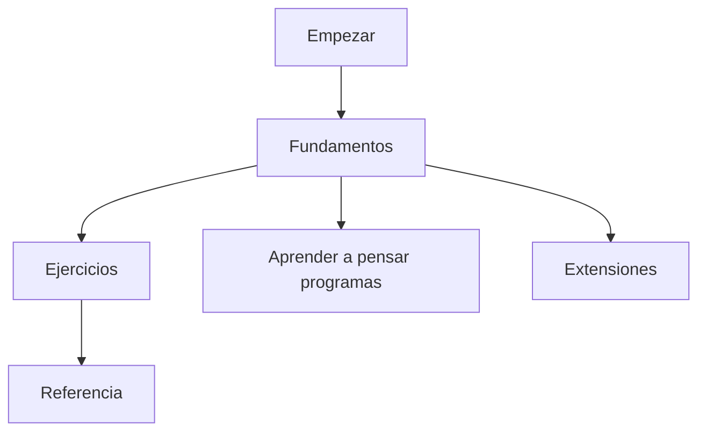

# Aprender Thorio

Bienvenido a la documentacion publica de Thorio.

La idea de este sitio es simple: aprender a programar con un lenguaje que se escribe en espanol y que se puede colocar dentro de bloques Markdown.

## Como usar esta documentacion

Si nunca has programado, sigue este orden:

1. [Que es Thorio](./empezar/que-es-thorio.md)
2. [Tu primer programa](./empezar/tu-primer-programa.md)
3. [Inicio y fin](./fundamentos/inicio-y-fin.md)
4. [Variables](./fundamentos/variables.md)
5. [Mostrar y leer](./fundamentos/mostrar-y-leer.md)
6. [Decisiones con si](./fundamentos/decisiones-si.md)
7. [Ciclos mientras](./fundamentos/ciclos-mientras.md)
8. [Camile](./extensiones/camile.md)
9. [Julie](./extensiones/julie.md)
10. [Como usar thorio-platform](./extensiones/usar-thorio-platform.md)
11. [Primer ejercicio](./ejercicios/01-secuencia.md)

## Mapa general

## Secciones

- [Empezar](./empezar/que-es-thorio.md)
- [Fundamentos](./fundamentos/inicio-y-fin.md)
- [Extensiones](./extensiones/camile.md)
- [Como usar thorio-platform](./extensiones/usar-thorio-platform.md)
- [Ejercicios](./ejercicios/01-secuencia.md)
- [Referencia](./referencia/sintaxis-basica.md)
- [Ruta de aprendizaje](./anexos/ruta-de-aprendizaje.md)

## Idea central

En Thorio no solo aprendes comandos. Aprendes a:

- describir pasos con claridad
- guardar informacion en variables
- tomar decisiones
- repetir procesos
- dividir problemas grandes en partes pequenas
